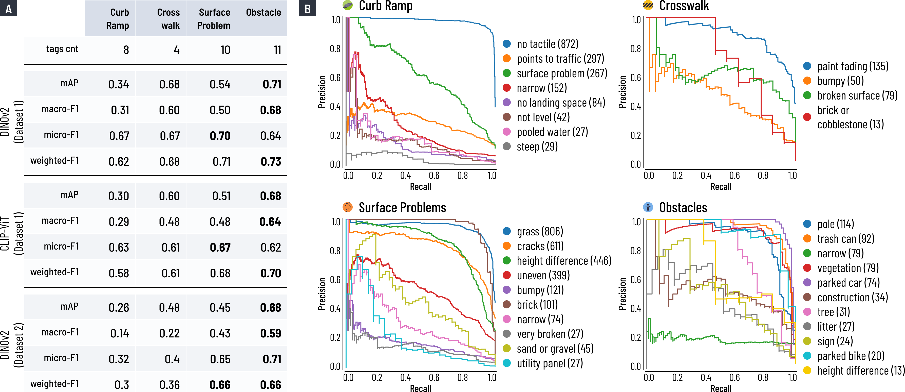

# Towards Fine-Grained Sidewalk Accessibility Assessment with Deep Learning: Initial Benchmarks and an Open Dataset

> **Alex (Xinlei) Liu\*, Kevin Wu\*, Minchu Kulkarni, Michael Sugstad, Peyton Rapo, Jeremy Freiburger, Maryam Hosseini, Chu Li, Jon E. Froehlich**
> 
> We examine the feasibility of using deep learning to infer 33 classes of sidewalk accessibility conditions in pre-cropped streetscape images, including bumpy, brick/cobblestone, cracks, height diference (uplifts), narrow, uneven/slanted, pole, and sign. We present two experiments: frst, a comparison between two state-of-the-art computer vision models, Meta’s DINOv2 and OpenAI’s CLIP-ViT, on a cleaned dataset of ∼24k images; second, an examination of a larger but noisier crowdsourced dataset (∼87k images) on the best performing model from Experiment 1. Though preliminary, Experiment 1 shows that certain sidewalk conditions can be identifed with high precision and recall, such as missing tactile warnings on curb ramps and grass grown on sidewalks, while Experiment 2 demonstrates that larger but noisier training data can have a detrimental efect on performance. We contribute an open dataset and classifcation benchmarks to advance this important area.

(\* denotes equal contribution)

## Example images from Project Sidewalk Dataset

## Results

## Datasets

This repository contains:
- Code to train and evaluate multi-label classification models with DINOv2 model and OpenAI ViT-CLIP models as base models for predicting Project Sidewalk's tags to assess sidewalk accessibility conditions.
- Links to two datasets: 
  - [Cleaned Dataset (Dataset 1)](to be added)
  - [Uncleaned Dataset (Dataset 2)](to be added)

For each dataset, we provide:
- A directory containing the images and the corresponding tags information in a CSV file organized by label type.
- The CSV file contains the image names, normalized X and Y coordinates of the label points, and their corresponding multi-hot encoded labels information.

## Training Configuration

There are two main notebooks to train DINOv2 and CLIP-ViT models:
- `notebooks/dino-trainer.ipynb`: Train DINOv2 model.
- `notebooks/clip-vit-trainer.ipynb`: Train CLIP-ViT model.

Both notebooks use a pretrained model and fine-tune it on the Project Sidewalk dataset and provide customizable training for different label types (e.g. curb ramps, surface problems). The `test.py` script evaluates the models and creates visualization of the results.

## Requirements

- PyTorch
- torchvision  
- matplotlib
- pandas
- scikit-learn

The DinoV2 pre-trained weights should be downloaded separately.

## Usage

### Training

1. Change the `label-type` variable to the label type you want to train on. `dataset_group` should be either 'validated' or 'unvalidated'. (Do not change the `c12n_category`, `gsv_not_pannellum`, `image_dimension`, `base_model_size` variables.)

2. Ensure the training data is available in `../datasets-[validated|unvalidated]/crops-<label_type>-tags/train/` directory. The corresponding CSV file should be in the same directory with name `train.csv`.

3. Run all cells in the notebook to train the model.

4. The best model will be saved based on training accuracy and loss.

5. If you want to resume training from a checkpoint, set `should_resume_training` to `True` and provide the checkpoint path in `checkpoint_path` variable.

Both `dino-trainer.ipynb` and `clip-vit-trainer.ipynb` require the same dataset structure and label type configuration.

### Evaluation

- Use the `notebooks/test.py` to evaluate the model on the test dataset. Adjust the fields in `params` object as needed.
- The model should be available in the `models` directory. The naming format for the model file is `[validated|unvalidated]-[dino|clip]-cls-b-<label_type>-tags-best.pth` e.g. `validated-dino-cls-b-surfaceproblem-tags-best.pth`.
- The test dataset should be available in the `../datasets/crops-<label_type>-tags/test/` directory. The directory should contain the images and the correspoding CSV file with ground truth labels. The CSV file should be named as `test.csv`.
- The script will save the inference results in the `../datasets/crops-<label_type>-tags/` directory.
